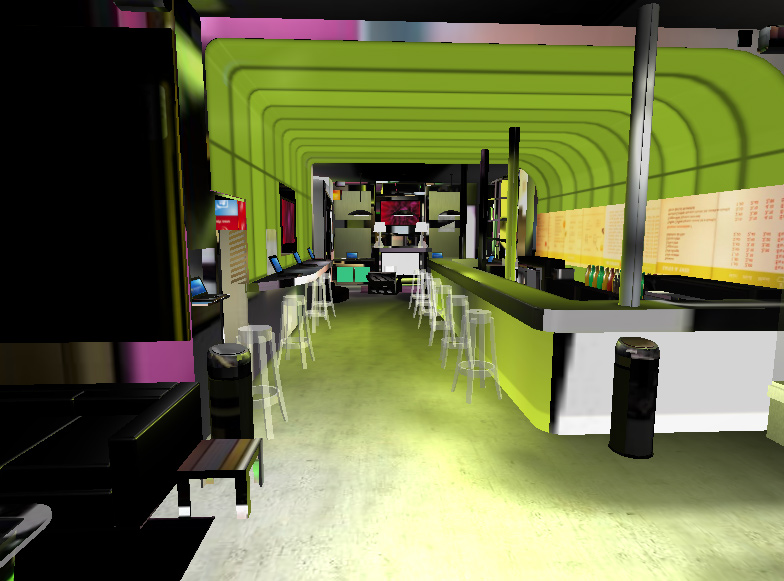

ds.babylonHxEx2
(DemoScene).babylonHxEx2
=============
<pre>
██████╗  █████╗ ██████╗ ██╗   ██╗██╗      ██████╗ ███╗   ██╗██╗  ██╗██╗  ██╗███████╗██╗  ██╗██████╗ 
██╔══██╗██╔══██╗██╔══██╗╚██╗ ██╔╝██║     ██╔═══██╗████╗  ██║██║  ██║╚██╗██╔╝██╔════╝╚██╗██╔╝╚════██╗
██████╔╝███████║██████╔╝ ╚████╔╝ ██║     ██║   ██║██╔██╗ ██║███████║ ╚███╔╝ █████╗   ╚███╔╝  █████╔╝
██╔══██╗██╔══██║██╔══██╗  ╚██╔╝  ██║     ██║   ██║██║╚██╗██║██╔══██║ ██╔██╗ ██╔══╝   ██╔██╗ ██╔═══╝ 
██████╔╝██║  ██║██████╔╝   ██║   ███████╗╚██████╔╝██║ ╚████║██║  ██║██╔╝ ██╗███████╗██╔╝ ██╗███████╗
╚═════╝ ╚═╝  ╚═╝╚═════╝    ╚═╝   ╚══════╝ ╚═════╝ ╚═╝  ╚═══╝╚═╝  ╚═╝╚═╝  ╚═╝╚══════╝╚═╝  ╚═╝╚══════╝
                                                                                                                                                                                                                                                                                        
</pre>

	
Simple BabylonJS example simple lights scene proted to haXe (http://www.babylonjs.com/)

	
Simple usage download an add your refrence to BabylonHX in the source path and then compile.

