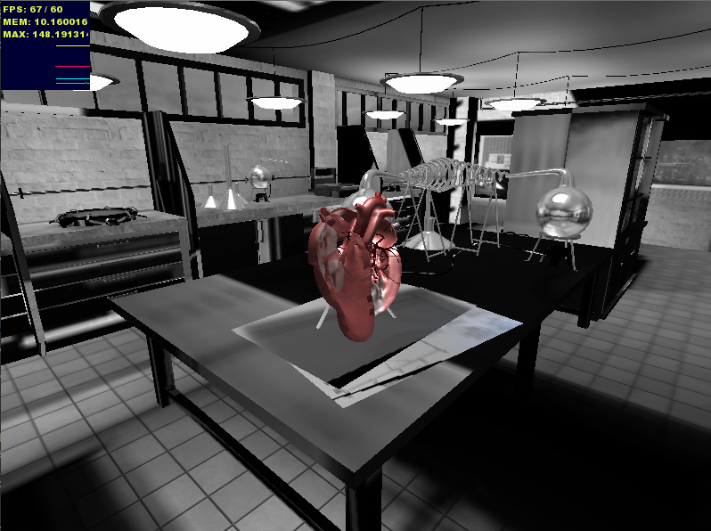

ds.babylonHxEx3
(DemoScene).babylonHxEx3
=============
<pre>
 _______ _______ _______ __   __ ___     _______ __    _ __   __ __   __ _______ __   __ _______ 
|  _    |   _   |  _    |  | |  |   |   |       |  |  | |  | |  |  |_|  |       |  |_|  |       |
| |_|   |  |_|  | |_|   |  |_|  |   |   |   _   |   |_| |  |_|  |       |    ___|       |___    |
|       |       |       |       |   |   |  | |  |       |       |       |   |___|       |___|   |
|  _   ||       |  _   ||_     _|   |___|  |_|  |  _    |       ||     ||    ___||     ||___    |
| |_|   |   _   | |_|   | |   | |       |       | | |   |   _   |   _   |   |___|   _   |___|   |
|_______|__| |__|_______| |___| |_______|_______|_|  |__|__| |__|__| |__|_______|__| |__|_______|
                                                                                                                                                                                                                                                                                     
</pre>

WIP please note Mesh is being refactored to support AbastractMesh, InstancedMesh, etc..

Also ShaderMaterial is being added the goal is to use the new library to run examples like clouds

http://www.babylonjs.com/Scenes/Clouds/index.html

