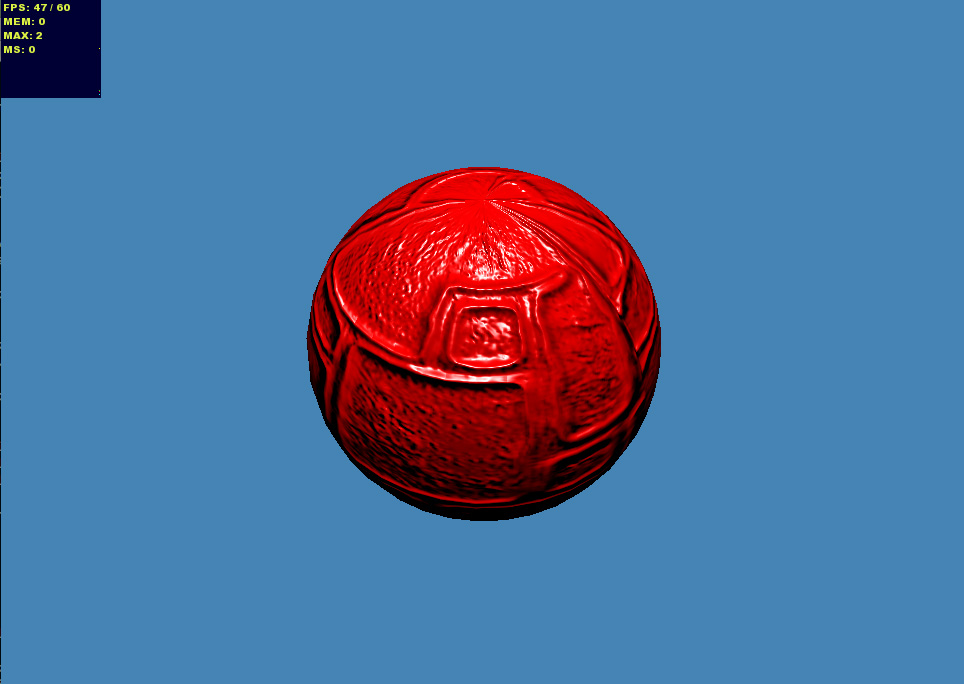

ds.babylonHxEx7
(DemoScene).babylonHxEx7
=============
<pre>
 _           _           _             _   _      _____     ______
| |         | |         | |           | | | |    |  ___|   |___  /
| |__   __ _| |__  _   _| | ___  _ __ | |_| |_  _| |____  __  / / 
| '_ \ / _` | '_ \| | | | |/ _ \| '_ \|  _  \ \/ /  __\ \/ / / /  
| |_) | (_| | |_) | |_| | | (_) | | | | | | |>   | |___>   ./ /   
|_.__/ \__,_|_.__/ \__, |_|\___/|_| |_\_| |_/_/\_\____/_/\_\_/    
                    __/ |                                         
                   |___/                                                                                                                                                                                                    
</pre>

	
Simple BabylonJS example simple lights scene proted to haXe (http://www.babylonjs.com/)

	
Simple usage download an add your refrence to BabylonHX in the source path and then compile.

