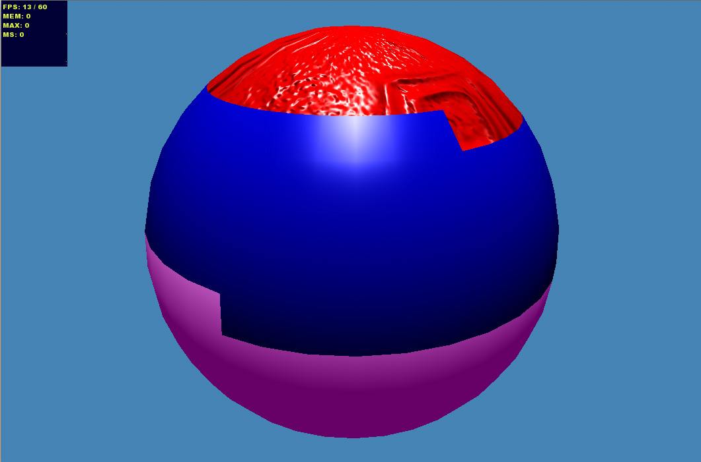

ds.babylonHxEx8
(DemoScene).babylonHxEx8
=============
<pre>
 ____  __  ____ _  _ __    __  __ _  _  _ _  _ ____ _  _ ____ 
(  _ \/ _\(  _ ( \/ |  )  /  \(  ( \/ )( ( \/ |  __| \/ ) _  \
 ) _ (    \) _ ()  // (_/(  O )    /) __ ()  ( ) _) )  () _  (
(____|_/\_(____(__/ \____/\__/\_)__)\_)(_(_/\_|____|_/\_)____/                                                                              
</pre>

	
Simple BabylonJS example simple lights scene proted to haXe (http://www.babylonjs.com/)

	
Simple usage download an add your refrence to BabylonHX in the source path and then compile.

