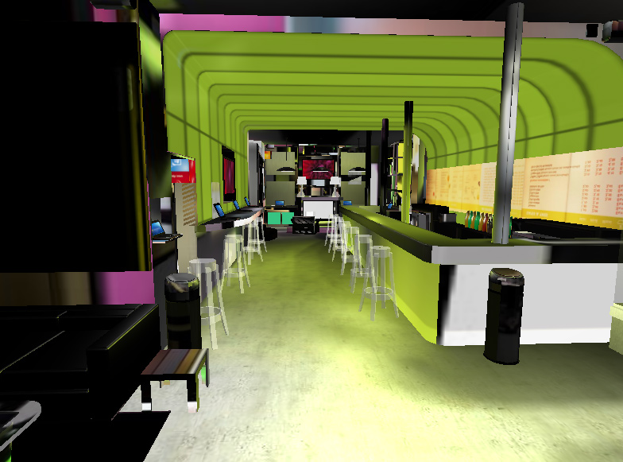

ds.babylonHxEx2
(DemoScene).babylonHxEx2
=============
<pre>
 _           _           _                           __      ____  
| |__   __ _| |__  _   _| | ___  _ __   /\  /\_  __ /__\_  _|___ \ 
| '_ \ / _` | '_ \| | | | |/ _ \| '_ \ / /_/ | \/ //_\ \ \/ / __) |
| |_) | (_| | |_) | |_| | | (_) | | | / __  / >  //__  >   / __/ 
|_.__/ \__,_|_.__/ \__, |_|\___/|_| |_\/ /_/ /_/\_\__/ /_/\_\_____|
                   |___/                                           
                                                                                                                                                                                                                                                                                        
</pre>

	
Simple BabylonJS example simple lights scene proted to haXe (http://www.babylonjs.com/)

	
Simple usage download an add your refrence to BabylonHX in the source path and then compile.

